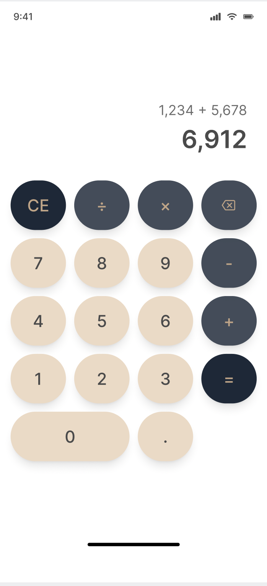

# 📱 Simple Calculator (Java, Android Studio)
## 📖 Project Description
This is a beginner-friendly mobile application built with **Java** and **Android Studio**.  
The app provides a clean and interactive interface to perform basic arithmetic operations such as:

- ➕ Addition  
- ➖ Subtraction  
- ✖ Multiplication  
- ➗ Division
  

    
  

### ✨ Features
- Support for **decimal numbers**  
- **Error handling** for division by zero  
- **Clear button** to reset inputs and results  

---

## 🎯 Purpose
This project was created to practice **Android development basics** (activities, buttons, listeners, and event handling) and to strengthen core **Java programming** concepts.

---

## 🛠 Technologies Used
- **Java**  
- **Android Studio**  
